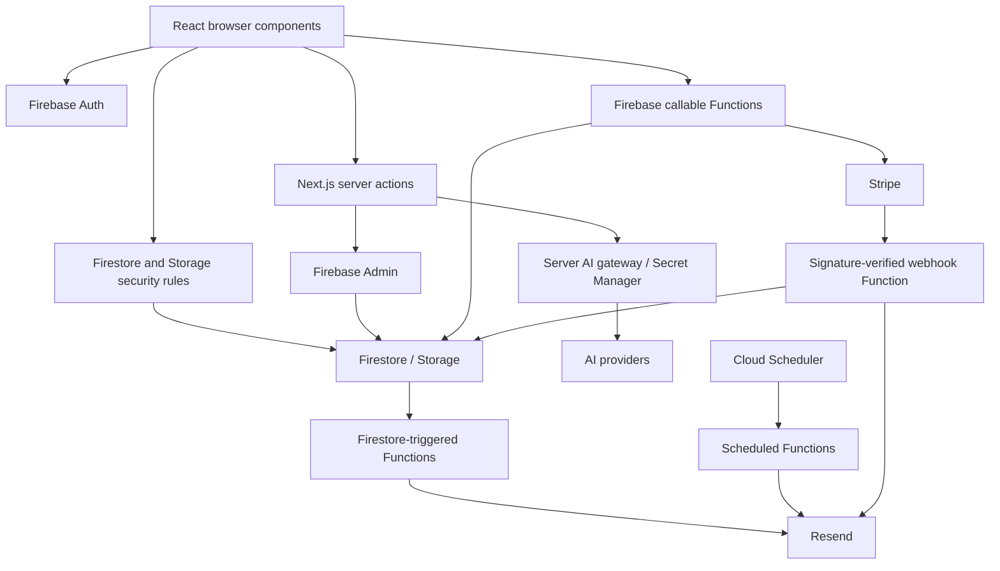

# KonnectedRoots system architecture

This describes the current implementation, including inconsistencies retained for later review. It is not a proposed redesign. See the [route/Function inventory](ROUTE_FUNCTION_INVENTORY.md) and [environment reference](../configuration/ENVIRONMENT_VARIABLES.md).

## Browser and Next.js

`src/app/layout.tsx` composes shared UI/providers. App Router serves marketing/auth pages and protected dashboard/tree/admin experiences. Client entry points use `use client` for hooks, events, Firebase listeners or interactive Radix components. Static metadata layouts and JSON-LD stay server-rendered. No client declarations were removed merely for architectural purity; the removed empty `(auth)` layout had no child routes and wrapped none of the actual auth pages.

`src/hooks/useAuth.tsx` subscribes to Firebase Auth, reads `users/{uid}`, and supplies user/profile/admin state. Login/signup controls use the browser Auth SDK. Browser ID tokens travel explicitly to privileged server actions/callables. Next metadata requests do not receive the Firebase browser session as an authenticated server cookie; they cannot assume access to private tree data.

`src/lib/firebase/clients.ts` initializes Auth, Firestore, Storage and callable Functions from public typed config. Root client code and backend code do not share a private configuration barrel. `src/lib/firebase/admin.ts` is guarded by `server-only`; Vercel requires explicit private service-account configuration. Google-hosted/explicit ADC and local development/test behavior remain separate.

## Authorization and data access

Browser operations are constrained by `firestore.rules` and `storage.rules`. Tree ownership, collaborator maps and admin claims determine access. Tree roles are owner, manager, editor and viewer; manager/editor write scopes differ. A `public` visibility value currently does not independently authorize anonymous Firestore reads. This mismatch between visibility/SEO and access rules is documented rather than changing sharing behavior in Phase 1.

`src/app/admin/actions.ts` verifies ID tokens, then accepts admin claims or a server-read profile role fallback. It writes `audit_logs` for mutations. `src/app/admin/ai-configuration/actions.ts` deliberately requires verified Auth claims, checks revocation, and requires `super_admin` for credentials/custom endpoints. These are different authorization contracts. Do not broaden credential authorization to match legacy profile fallback.

`getSystemConfiguration` is a public server action consumed by shared banners/feature UI. Its Firestore shape must contain no secrets. Other admin console screens obtain users, trees, billing summaries, reports, audit logs and contact messages through privileged actions. Summary/status cards are not independent proof of live external-service health.

## Trees, relationships, invitations and exports

`src/app/dashboard/page.tsx` and `src/components/dashboard/*` create/list/edit trees. `src/app/tree/[treeId]/page.tsx` resolves document IDs or owner/collaborator slugs, subscribes to the tree and `trees/{id}/people`, then saves edits through browser Firestore writes/batches. `FamilyTreeCanvasPlaceholder.tsx` renders SVG nodes/connections. `useUndoRedo.ts` and `src/lib/layout-history.ts` manage commands and stored snapshots. Relationship finding is deterministic (`src/ai/flows/find-relationship-flow.ts`), not an AI invocation.

`ShareDialog.tsx` creates invitations and notifications in Firestore; `src/app/invite/[inviteId]/page.tsx` invokes `acceptInvitation`. The Function verifies the accepting email and current inviter authority, updates collaborators/invitation status transactionally, and sends an email afterward. `src/types/invitations.ts` is the shared browser domain shape; Functions remain an independently compiled runtime using stored records.

`src/lib/uploadPersonPhoto.ts` uploads browser-authenticated images to Storage. The unused-by-source `handleUploadProfilePicture` server action still uses the browser Storage SDK without browser Auth; retained as a legacy boundary exception pending endpoint retirement or an explicitly authenticated redesign. Do not switch it to Admin Storage without ownership checks.

`ExportDialog.tsx` creates PDF/PNG with html2canvas/jsPDF and GEDCOM with `src/lib/gedcom-generator.ts`; `gedcom-parser.ts` imports genealogy records. Export entitlement/usage checks remain unchanged. Phase 1 removes console dumps of family names, identifiers and relationships. The separate PR #4 full-tree capture fix was not merged into the Phase 1 starting master and is not duplicated here; viewport completeness remains that PR's scope.

## Billing and email

`src/lib/billing` contains public types/constants, browser entitlements/usage helpers and guarded `serverUsage.ts` for token verification/credit accounting. The public billing barrel exports browser helpers, so server-only consumers should prefer explicit modules. It never exports `serverUsage`.

`functions/src/stripeBilling.ts` exposes authenticated checkout, portal and AI-pack callables. Stripe secrets are read only in Functions; price mappings are authoritative there. `stripeWebhook.ts` uses raw-body signature verification and event records to avoid repeated processing, updates Firestore billing data and sends payment emails. No live payment, webhook replay or Functions deployment is performed by this phase.

`functions/src/sendEmail.ts` owns Resend initialization/retries; `emailTemplates.ts` owns templates and uses Functions' canonical APP_URL. Email failures return safe messages and log operation classifications; success logs no longer include recipient addresses. Existing email preferences, schedules and secret bindings remain intact. Remaining email/trigger logging still needs a broader personal-data review.

## AI, OCR and telemetry

Six AI feature wrappers under `src/ai/flows` call `src/lib/ai/gateway.ts`, using provider adapters under `src/lib/ai/providers`. The gateway verifies context, validates capabilities, reserves budgets, enforces circuit state and records usage. OCR validates structured extraction responses; image processing uses Sharp server-side. See [AI control plane](../AI_CONTROL_PLANE.md) for detailed routing/vault behavior.

Google Secret Manager stores provider credentials. Firestore `ai_configuration`, `ai_providers`, `ai_invocations`, `ai_usage_months` and `ai_model_health` contain private metadata/usage, not raw keys. `ai/telemetry.ts` records budget/operational audit data without prompts, images or generated text. Legacy server-only Google environment fallback remains documented for migration.

The unimported `src/ai/genkit.ts` initializer was removed. `src/ai/dev.ts`, developer npm scripts and Genkit dependencies remain because they are explicit developer entry points and their future use is uncertain. No telemetry exporter, listener or auto-instrumentation was enabled. The accepted residual Genkit/OpenTelemetry dependency graph remains visible.

## Functions and deployment boundaries

Functions use Node 20, `functions/tsconfig.json`, their own package-lock and generated `functions/lib`. Root Next tsconfig excludes Functions source. No root-only import was introduced in Functions; its typed environment module is `functions/src/config.ts`. Source helpers shared across these deployments require deliberate packaging, not accidental parent-directory imports.

Firestore triggers count tree members, deliver invitation/welcome emails and retain an inert historical owner-claim trigger. Scheduled Functions send weekly digests, daily inactivity reminders and expiration reminders. Their exact exports/schedules are in the inventory. Deployed trigger retirement requires owner review.

Vercel hosts Next.js; Firebase hosts Auth/data/Functions. Firebase CLI configuration still includes a legacy Hosting stanza, retained because static references cannot prove it has no operator use. `.idx` demo emulators are not wired into runtime clients. No cloud settings were changed.

## Metadata and sitemap boundaries

Anonymous metadata performs lazy Admin reads only for runtime public metadata, supports document IDs/public slugs, and memoizes within a request. Private, absent, ambiguous or failed lookups return generic noindex metadata. The authenticated tree listener sets a title from the already-authorized snapshot; errors/unmount reset it. This fixes the slug-as-document-ID defect without publishing private tree names.

`src/app/sitemap.ts` lists eight deterministic public marketing/legal routes and never imports Admin or exposes tree/dashboard/admin URLs. Public tree SEO metadata still exists, but automatic database discovery in the sitemap was removed to match current authenticated tree access and eliminate build-time private credentials. A future public-tree sharing/indexing feature needs an explicit publication contract.
